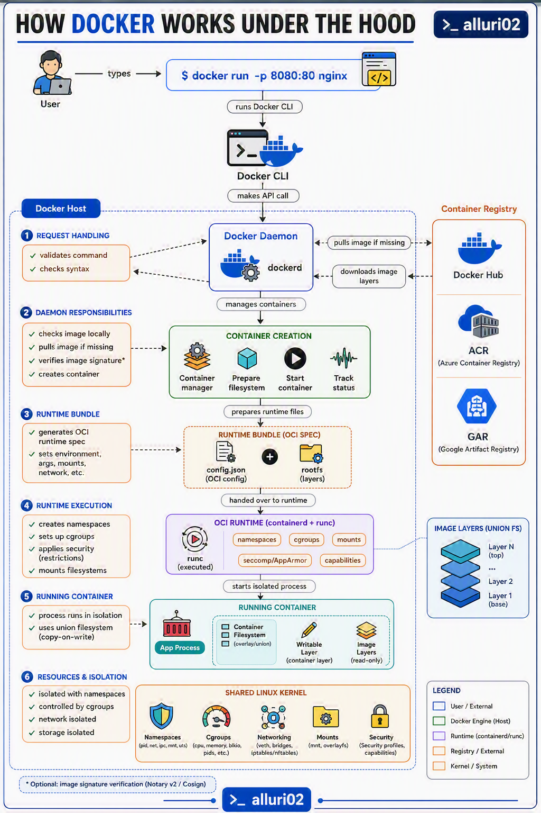
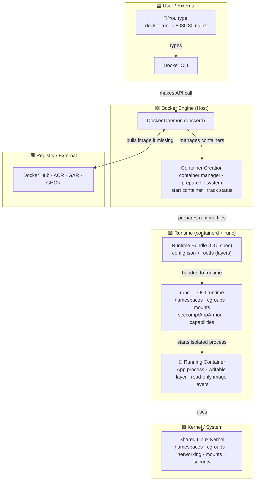

# Lesson 01: How Docker Works Under the Hood

> When you type `docker run -p 8080:80 nginx`, **six things happen** before a process is running
> in isolation. Most developers only see the first and the last. This lesson walks the whole path.

---

## Reference Diagram



<sub>The full flow this lesson traces — CLI → `dockerd` → `containerd` → `runc` → shared kernel,
with the registry column and Union FS image layers. Everything below is a written walk-through of
this diagram. *(Diagram credit: alluri02)*</sub>

---

## The One Command, Fully Traced

```bash
docker run -p 8080:80 nginx
```



---

## The Six Stages

### ① Request Handling — the CLI talks to the daemon

The `docker` command you run is **just a client**. It does almost nothing itself — it:

1. **Validates** the command and checks syntax.
2. Serializes your request into a **REST API call**.
3. Sends it to the **Docker daemon** over a socket (`/var/run/docker.sock` on Linux, a named
   pipe on Windows).

> **Mental model:** the CLI is `curl`. The daemon is the web server. `docker run ...` is just a
> friendly wrapper around an HTTP `POST /containers/create` + `POST /containers/{id}/start`.

```bash
# Prove it — talk to the daemon directly, no docker CLI:
curl --unix-socket /var/run/docker.sock http://localhost/version
```

### ② Daemon Responsibilities — `dockerd` orchestrates

The **Docker daemon (`dockerd`)** is the long-running background service. On receiving the API
call it:

1. **Checks if the image exists locally.**
2. If missing, **pulls it from a registry** (Docker Hub, ACR, GHCR, GAR) — downloading each layer.
3. *(Optional)* **Verifies the image signature** (Notary v2 / Cosign) if content trust is enabled.
4. Kicks off **container creation** and tracks its status.

But `dockerd` **does not create the container itself.** It delegates to `containerd`.

### ③ Runtime Bundle — building the OCI spec

`containerd` takes the image and prepares a **runtime bundle** that follows the
**OCI (Open Container Initiative) spec** — the vendor-neutral standard so any runtime can run it:

| File | What it is |
|------|-----------|
| **`config.json`** | The OCI config: env vars, args, mounts, the command to run, resource limits, which namespaces to create |
| **`rootfs/`** | The container's root filesystem — the image's layers stacked together |

> **Why this matters:** because of the OCI standard, Docker isn't the only thing that can run
> these. Kubernetes, Podman, and CRI-O all consume the exact same bundle. The image you build
> here is *not* locked to Docker.

### ④ Runtime Execution — `runc` does the real work

`containerd` hands the bundle to **`runc`**, the low-level OCI runtime. This is where the actual
**Linux isolation primitives** get created:

- **Creates namespaces** → the process gets its own view of PIDs, network, mounts, hostname, users.
- **Sets up cgroups** → limits on CPU, memory, block I/O, number of PIDs.
- **Applies security** → `seccomp` (syscall filtering), `AppArmor`/`SELinux`, dropped **capabilities**.
- **Mounts filesystems** → the union/overlay root filesystem is mounted.

Then `runc` **execs your process** inside all of that — and exits. The container process is now
a direct child of `containerd-shim`, not of `runc`.

### ⑤ Running Container — an isolated process

You now have a **running container**:

- The app process (e.g. `nginx`) runs **in isolation** — it thinks it's PID 1 on its own machine.
- It sees a **union filesystem** (copy-on-write): read-only image layers at the bottom, one
  thin **writable layer** on top for any changes it makes.

```
┌──────────────────────────────┐
│  Writable layer (this container, R/W)   │  ← your changes go here
├──────────────────────────────┤
│  Image layer N (read-only)              │
│  ...                                     │
│  Image layer 1 — base (read-only)       │
└──────────────────────────────┘
        ▲ union / overlay filesystem
```

### ⑥ Resources & Isolation — the shared kernel

Crucially, the container is **isolated but not virtualized**. It shares the **host's Linux kernel**.
That kernel provides every isolation primitive:

| Kernel feature | Provides | Examples |
|----------------|----------|----------|
| **Namespaces** | *What the process can see* | `pid`, `net`, `ipc`, `mnt`, `uts`, `user` |
| **Cgroups** | *What the process can use* | cpu, memory, blkio, pids |
| **Networking** | Virtual network stack | veth pairs, bridges, iptables/nftables |
| **Mounts** | Filesystem view | `mnt` namespace, overlayfs |
| **Security** | Restrict the process | seccomp, capabilities, AppArmor/SELinux |

---

## Container vs Virtual Machine

This is the question everyone asks. The difference is **the kernel**.

```
   VIRTUAL MACHINE                    CONTAINER
┌──────────────────┐          ┌──────────────────┐
│  App A  │  App B  │          │  App A  │  App B  │
├─────────┼─────────┤          ├─────────┼─────────┤
│ Guest OS│ Guest OS│  ← heavy │  (no guest OS)    │
├─────────┴─────────┤          ├──────────────────┤
│    Hypervisor      │          │  Docker Engine    │
├──────────────────┤          ├──────────────────┤
│      Host OS       │          │  Host OS (kernel  │  ← SHARED
├──────────────────┤          │  shared by all)    │
│     Hardware       │          ├──────────────────┤
└──────────────────┘          │     Hardware       │
                               └──────────────────┘
```

| | Virtual Machine | Container |
|-|-----------------|-----------|
| **Isolation unit** | Full guest OS + kernel | A process (namespaces + cgroups) |
| **Boots in** | Seconds–minutes | Milliseconds |
| **Size** | GBs (whole OS) | MBs (just your app + deps) |
| **Overhead** | Hypervisor + guest kernel | Almost none — it's a process |
| **Kernel** | Its own | **Shared with the host** |

> This is *why* Docker on Mac/Windows quietly runs a tiny **Linux VM** — containers need a Linux
> kernel, so Docker Desktop provides one. On Linux, containers use the host kernel directly.

---

## Who's Who: The Component Stack

| Component | Role | Analogy |
|-----------|------|---------|
| **`docker` CLI** | Sends API requests | `curl` / `psql` client |
| **`dockerd`** | High-level engine: images, networks, volumes, API | The web server |
| **`containerd`** | Manages container lifecycle & images | The job scheduler |
| **`containerd-shim`** | Keeps a container alive if `dockerd` restarts | A babysitter process |
| **`runc`** | Creates namespaces/cgroups, execs the process | The kernel-level "do it" tool |

```bash
# See the stack for yourself on a Linux host:
ps aux | grep -E 'dockerd|containerd|runc'
```

---

## Try It

```bash
# 1. Run a container and publish a port (the command from the diagram)
docker run -d -p 8080:80 --name web nginx
curl http://localhost:8080          # nginx welcome page

# 2. Peek at the isolation the kernel gave it
docker exec web ps aux              # PID 1 is nginx — its own PID namespace
docker inspect web --format '{{ .HostConfig.PortBindings }}'

# 3. See resource controls (cgroups)
docker stats web --no-stream        # live CPU / memory usage

# 4. Clean up
docker rm -f web
```

---

## Key Takeaways

1. **Docker is a stack, not a program:** CLI → `dockerd` → `containerd` → `runc` → kernel.
2. **The CLI is just a client** — it makes REST API calls to the daemon.
3. **`dockerd` orchestrates; `runc` does the low-level work** of creating namespaces & cgroups.
4. **The OCI bundle** (`config.json` + `rootfs`) is a standard — your images aren't locked to Docker.
5. **A container is an isolated process, not a VM.** No guest OS — it **shares the host kernel**.
6. **Isolation = namespaces (what you see) + cgroups (what you use)**, both provided by the kernel.

---

## Next: [Lesson 02 — Images & Layers](02-images-and-layers.md)
We'll open up the image itself: the union filesystem, read-only layers, and copy-on-write.
