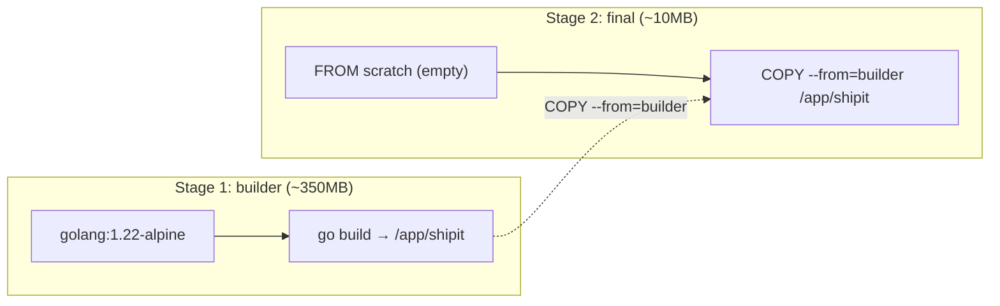

# Lesson 03: Dockerfile Deep Dive

> This lesson dissects **this repo's real [`Dockerfile`](../../Dockerfile)** — a multi-stage build
> that turns Go source into a **~10 MB** production image. Every line earns its place.

---

## The Whole File

```dockerfile
# ─── Stage 1: Build ───
FROM golang:1.22-alpine AS builder
WORKDIR /app

# Copy dependency files first (better layer caching)
COPY go.mod go.sum ./
RUN go mod download

# Copy source code and build
COPY . .
RUN CGO_ENABLED=0 GOOS=linux go build -ldflags="-s -w" -o shipit ./cmd/shipit

# ─── Stage 2: Run ───
FROM scratch
COPY --from=builder /app/shipit /shipit
COPY --from=builder /etc/ssl/certs/ca-certificates.crt /etc/ssl/certs/
EXPOSE 8080
ENTRYPOINT ["/shipit"]
CMD ["serve"]
```

Two stages. The first has the **whole Go toolchain (~350 MB)**. The second is **empty** and gets
**only the compiled binary**. The toolchain never ships.

---

## Instruction Reference

| Instruction | What it does | Creates a layer? |
|-------------|--------------|------------------|
| `FROM` | Sets the base image (or starts a new stage) | — |
| `WORKDIR` | Sets the working dir (and creates it) | metadata |
| `COPY` | Copies files from build context into the image | ✅ yes |
| `RUN` | Executes a command at **build time** | ✅ yes |
| `ENV` | Sets an environment variable | metadata |
| `ARG` | Build-time variable (not in final image) | — |
| `EXPOSE` | Documents which port the app listens on | metadata |
| `ENTRYPOINT` | The fixed executable to run | metadata |
| `CMD` | Default args (overridable at `docker run`) | metadata |

> **`RUN` vs `CMD`/`ENTRYPOINT`:** `RUN` happens **while building the image**. `CMD`/`ENTRYPOINT`
> define what runs **when the container starts**. Confusing these is the #1 Dockerfile mistake.

---

## Deep Dive: Multi-Stage Builds

The problem multi-stage solves: your **build tools** (compilers, SDKs) are huge and you do **not**
want them in the thing you ship to production.



- `AS builder` **names** the first stage.
- `COPY --from=builder` reaches into that stage and pulls out **just the artifact**.
- Everything else in stage 1 (Go compiler, source, caches) is **discarded**.

**Language comparison (same idea everywhere):**

```dockerfile
# C#:   FROM sdk AS build → dotnet publish → FROM aspnet (copy publish output)
# Java: FROM maven AS build → mvn package → FROM jre (copy the .jar)
# Go:   FROM golang AS build → go build → FROM scratch (copy the binary)
```

---

## Deep Dive: `FROM scratch`

`scratch` is a **special empty image — literally 0 bytes**. No shell, no package manager, no libc.
You can only use it if your binary is **fully self-contained**. A statically-linked Go binary is.

That's why two extra things are needed:

```dockerfile
# 1. CA certificates — scratch has none, so HTTPS calls (AI API, Azure) would fail
COPY --from=builder /etc/ssl/certs/ca-certificates.crt /etc/ssl/certs/
```

```dockerfile
# 2. A static binary — enabled by the build flags below
RUN CGO_ENABLED=0 GOOS=linux go build -ldflags="-s -w" -o shipit ./cmd/shipit
```

| Flag | Meaning | Why it's needed for `scratch` |
|------|---------|------------------------------|
| `CGO_ENABLED=0` | Pure Go, no C libraries (no dynamic libc) | **Required** — `scratch` has no libc to link against |
| `GOOS=linux` | Target Linux | Containers run on the Linux kernel |
| `-ldflags="-s -w"` | Strip symbol table (`-s`) + debug info (`-w`) | Shrinks the binary ~35% |

> **Trade-off:** `scratch` has no shell, so you **can't** `docker exec ... sh` into it to debug.
> If you need that, use `gcr.io/distroless/static` or `alpine` as the final base instead.

---

## Deep Dive: Layer Caching (the `go.mod` trick)

Look carefully at the **order** of the build stage:

```dockerfile
COPY go.mod go.sum ./     # ① deps manifest only
RUN go mod download       # ② download deps  ← EXPENSIVE, rarely changes
COPY . .                  # ③ all source     ← changes on every edit
RUN CGO_ENABLED=0 ... build
```

Because Docker caches layers, and a layer's cache is only valid if **it and all prior layers are
unchanged**:

- Edit a `.go` file → layer ③ and after are rebuilt, but ① and ② stay **cached**. `go mod download`
  is **skipped**. Build is fast. ✅
- If you instead did `COPY . .` first, **any** code change would bust the deps cache and
  re-download everything every time. ❌

**Rule: order instructions from least-likely-to-change to most-likely-to-change.**

---

## Deep Dive: `.dockerignore`

`COPY . .` copies the **entire build context** to the daemon. Without a `.dockerignore`, that
includes `.git/`, local binaries, test data — slowing builds and bloating layers (and risking
leaking secrets).

A good `.dockerignore` for this repo:

```gitignore
.git
*.exe
shipit
docs/
*.md
.github/
```

> Analogy: `.dockerignore` is to `docker build` what `.gitignore` is to `git add`.

---

## `ENTRYPOINT` + `CMD` Together

```dockerfile
ENTRYPOINT ["/shipit"]    # always runs
CMD ["serve"]             # default arg — overridable
```

| You run | Actually executes |
|---------|-------------------|
| `docker run shipit` | `/shipit serve` |
| `docker run shipit process` | `/shipit process` |
| `docker run shipit demo` | `/shipit demo` |

`ENTRYPOINT` is the fixed program; `CMD` is the default argument you can override — perfect for
ShipIt's Cobra subcommands (`serve`, `process`, `demo`).

---

## Try It

```bash
# Build using the repo's Dockerfile
docker build -t shipit:local .

# Check the final size — should be ~10MB
docker image ls shipit:local

# Run the default command (serve)
docker run --rm -p 8080:8080 shipit:local

# Override CMD to run a different subcommand
docker run --rm shipit:local demo

# Prove the toolchain didn't ship: scratch has no shell, so this FAILS
docker run --rm shipit:local sh    # → error: exec sh: no such file (expected!)
```

---

## Key Takeaways

1. **Multi-stage builds** keep the toolchain out of production — build big, ship small.
2. **`FROM scratch`** = empty base; only works with a **static binary** (`CGO_ENABLED=0`).
3. **You must copy CA certs** into `scratch` for outbound HTTPS to work.
4. **`-ldflags="-s -w"`** strips debug info → smaller binary.
5. **Order matters for caching:** copy `go.mod` + download deps **before** copying source.
6. **`.dockerignore`** keeps junk (and secrets) out of the build context.
7. **`ENTRYPOINT` = fixed program, `CMD` = default overridable args.**

---

## Next: [Lesson 04 — Containers & Isolation](04-containers-and-isolation.md)
Now that we can build an image, we'll see exactly how the kernel isolates a running container.
