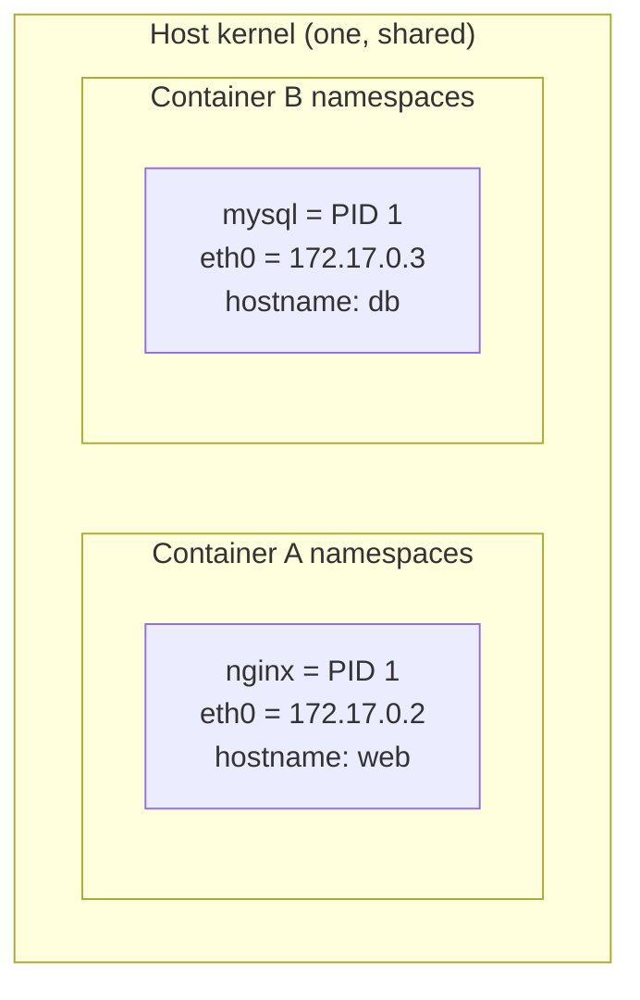
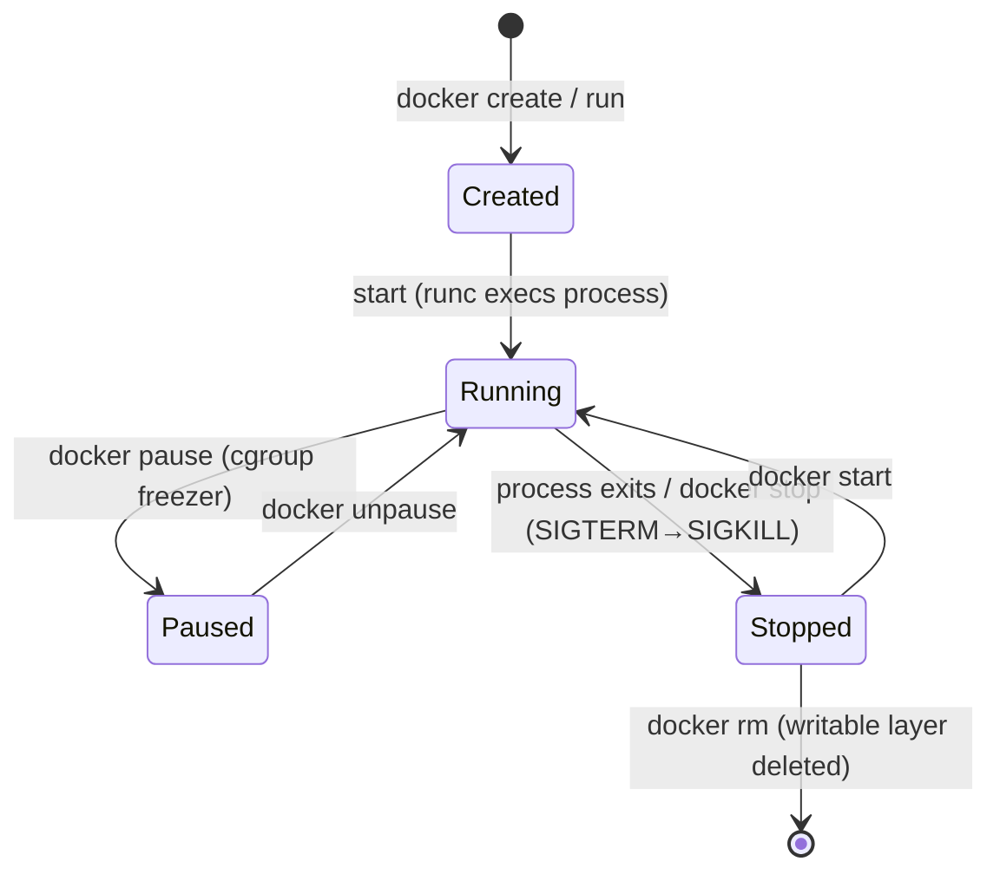

# Lesson 04: Containers & Isolation

> A container feels like a lightweight VM, but it's **just a Linux process** the kernel has been
> told to fence off. This lesson unpacks the two primitives that make it work — **namespaces**
> (what a process can *see*) and **cgroups** (what a process can *use*) — plus the security layers.

---

## The Core Equation

```
Container = Process  +  Namespaces (isolation)  +  cgroups (limits)  +  Security profiles
```

There is **no "container" object in the Linux kernel.** "Container" is just a name for a process
running with these features turned on. Docker/`runc` wires them up; the kernel enforces them.

---

## Namespaces — *What a Process Can See*

A namespace gives a process its **own private view** of a system resource. Processes in different
namespaces can't see each other's resources.

| Namespace | Isolates | Effect inside the container |
|-----------|----------|-----------------------------|
| **pid** | Process IDs | Your app is **PID 1**; can't see host processes |
| **net** | Network stack | Own interfaces, IPs, ports, routing table |
| **mnt** | Mount points | Own filesystem tree (the image's rootfs) |
| **uts** | Hostname / domain | Own hostname (`docker run --hostname`) |
| **ipc** | Shared memory, semaphores | Can't touch host IPC |
| **user** | User & group IDs | Can be root **inside**, unprivileged **outside** |



Both containers think they're PID 1 on their own machine. Neither can see the other. **Same kernel.**

```bash
# Inside a container: it sees only its own processes
docker run --rm alpine ps aux
#   PID USER   COMMAND
#     1 root   ps aux        ← it's PID 1, host processes invisible
```

---

## Cgroups — *What a Process Can Use*

**Control groups** cap and account for resource usage: CPU, memory, block I/O, PIDs. Without them,
one container could starve the whole host.

```bash
# Limit ShipIt to half a CPU and 128MB of RAM
docker run -d --name shipit \
  --cpus="0.5" \
  --memory="128m" \
  --pids-limit=100 \
  shipit:local

# Watch the limits being enforced live
docker stats shipit --no-stream
```

| Flag | cgroup controller | Effect |
|------|-------------------|--------|
| `--cpus="0.5"` | cpu | Max 50% of one core |
| `--memory="128m"` | memory | OOM-killed if it exceeds 128MB |
| `--pids-limit=100` | pids | Max 100 processes (fork-bomb guard) |
| `--blkio-weight` | blkio | Relative disk I/O priority |

> **Namespaces vs cgroups in one line:** *namespaces limit what you **see**, cgroups limit what you
> **use**.* You need both for real isolation.

---

## Security Layers — *Restricting What a Process Can Do*

Even isolated, a container process could try dangerous syscalls. Three layers reduce the blast
radius:

| Layer | What it does | Default in Docker |
|-------|--------------|-------------------|
| **Capabilities** | Splits root's powers into ~40 pieces; drops most | Drops all but a safe subset |
| **seccomp** | Filters which **syscalls** are allowed | Blocks ~44 dangerous syscalls |
| **AppArmor / SELinux** | Mandatory access control profiles | `docker-default` profile applied |

```bash
# Drop ALL capabilities, add back only what's needed (least privilege)
docker run --cap-drop=ALL --cap-add=NET_BIND_SERVICE shipit:local

# Run with an even stricter no-new-privileges flag
docker run --security-opt=no-new-privileges shipit:local
```

> **Root inside ≠ root outside.** With a **user namespace**, UID 0 in the container maps to an
> unprivileged UID on the host. Combined with dropped capabilities, a container "root" can do very
> little to the host. (More in Lesson 08.)

---

## The `docker run` Lifecycle



```bash
docker run -d --name web nginx     # create + start
docker pause web                   # freeze (cgroup freezer)
docker unpause web                 # resume
docker stop web                    # SIGTERM, then SIGKILL after grace period
docker start web                   # start it again
docker rm web                      # remove — writable layer gone forever
```

> **`stop` sends `SIGTERM`** first (graceful — your Go app can flush and close DB connections),
> then `SIGKILL` after ~10s. This ties directly to the Go track's **context cancellation**
> (Lesson 11): a well-behaved server listens for `SIGTERM` and shuts down cleanly.

---

## Peeking at the Isolation

```bash
docker run -d --name web nginx

# The container's PID as the HOST sees it (different from PID 1 inside!)
docker inspect --format '{{ .State.Pid }}' web

# List the namespaces that PID lives in (Linux host)
sudo ls -l /proc/$(docker inspect --format '{{ .State.Pid }}' web)/ns

# Its cgroup limits
docker inspect --format '{{ .HostConfig.Memory }}' web
```

---

## Container vs Process vs VM

| | Plain process | Container | VM |
|-|---------------|-----------|-----|
| Isolation | None | namespaces + cgroups | Full guest OS |
| Kernel | Host | **Host (shared)** | Own |
| Start time | Instant | Milliseconds | Seconds+ |
| Overhead | None | Tiny | Hypervisor + guest OS |

A container sits **between** a bare process and a VM: much more isolated than a process, far
lighter than a VM.

---

## Try It

```bash
# 1. Prove PID isolation
docker run --rm alpine sh -c 'echo "I am PID $$"; ps aux'

# 2. Prove and enforce a memory limit (this container gets OOM-killed)
docker run --rm --memory=16m alpine sh -c \
  'dd if=/dev/zero of=/dev/null bs=32M count=1'   # tries to use too much → killed

# 3. Prove network isolation — each container has its own IP
docker run -d --name a alpine sleep 300
docker run -d --name b alpine sleep 300
docker inspect -f '{{ .NetworkSettings.IPAddress }}' a
docker inspect -f '{{ .NetworkSettings.IPAddress }}' b   # different IP

docker rm -f a b
```

---

## Key Takeaways

1. **A container is a process** with namespaces + cgroups + security profiles — not a VM.
2. **Namespaces = what you can see** (pid, net, mnt, uts, ipc, user).
3. **Cgroups = what you can use** (cpu, memory, pids, blkio).
4. **Security layers** (capabilities, seccomp, AppArmor) shrink the blast radius.
5. **The kernel is shared** — isolation is enforced by kernel features, not a hypervisor.
6. **`docker stop` sends `SIGTERM` first** — handle it for graceful shutdown (ties to Go context).

---

## Next: [Lesson 05 — Registries](05-registries.md)
Where images come from and go to: Docker Hub, ACR, GHCR, and GAR — push, pull, and digests.
