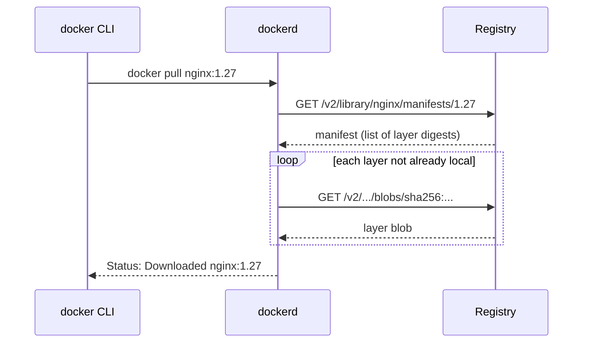

# Lesson 05: Registries

> A registry is **where images live** when they're not on your machine — the package repository of
> the container world. This repo's CI **builds and pushes** an image to GitHub Container Registry
> (GHCR) on every merge to `main`. We'll trace that exact flow.

---

## Concept Map

| Registry concept | It's basically... | Analogy |
|------------------|-------------------|---------|
| **Registry** | A server that stores images | **NuGet.org / Maven Central / npm registry** |
| **Repository** | All tags of one image | A **package** (`ghcr.io/alluri02/go-shipit`) |
| **`docker push`** | Upload an image | `nuget push` / `mvn deploy` / `npm publish` |
| **`docker pull`** | Download an image | `nuget restore` / `mvn install` / `npm install` |
| **Digest** | Content hash of the pushed image | A **lockfile hash** |

---

## The Registries You'll Meet

| Registry | Host | When you'd use it |
|----------|------|-------------------|
| **Docker Hub** | `docker.io` | Public base images (`nginx`, `golang`, `mysql`) |
| **GitHub Container Registry (GHCR)** | `ghcr.io` | **This repo** — images tied to the GitHub repo |
| **Azure Container Registry (ACR)** | `*.azurecr.io` | ShipIt's Azure deploy target (see main README) |
| **Google Artifact Registry (GAR)** | `*-docker.pkg.dev` | GCP deployments |
| **AWS ECR** | `*.dkr.ecr.*.amazonaws.com` | AWS deployments |

They all speak the **same OCI Distribution API**, so `docker push`/`pull` work identically —
only the hostname and login differ.

---

## Anatomy of an Image Reference

```
ghcr.io/alluri02/go-shipit:latest
└──┬──┘ └──────┬───────┘ └──┬─┘
registry    repository     tag

# Pinned by digest (immutable):
ghcr.io/alluri02/go-shipit@sha256:9f0e2c...
```

- **No registry?** Docker assumes `docker.io` → `nginx` really means `docker.io/library/nginx:latest`.
- **No tag?** Docker assumes `:latest`.

---

## Pull: What Actually Happens



The daemon downloads a **manifest** (the layer list), then fetches **only the layers it doesn't
already have**. Shared base layers are downloaded **once** across all your images.

```bash
docker pull nginx:1.27
# 1.27: Pulling from library/nginx
# a2abf6c4d29d: Pull complete      ← each line is a layer
# ...
# Digest: sha256:9f0e...           ← the immutable content hash
```

---

## Push: Ship Your Image

```bash
# 1. Log in (token/password sent once)
echo $TOKEN | docker login ghcr.io -u alluri02 --password-stdin

# 2. Tag your local image with the full registry path
docker build -t shipit:local .
docker tag shipit:local ghcr.io/alluri02/go-shipit:latest

# 3. Push — uploads only layers the registry doesn't already have
docker push ghcr.io/alluri02/go-shipit:latest
```

> **Tagging doesn't copy anything.** `docker tag` just adds another *name* pointing at the same
> image ID — like a git tag. The bytes are shared until you push.

---

## This Repo's CI Push (GHCR)

The real [`.github/workflows/ci.yml`](../../.github/workflows/ci.yml) pushes to GHCR **only on
push to `main`** (after lint + test + build pass):

```yaml
docker:
  needs: [build]
  if: github.event_name == 'push' && github.ref == 'refs/heads/main'
  permissions:
    packages: write                      # allowed to push to GHCR
  steps:
    - uses: docker/login-action@v3
      with:
        registry: ghcr.io
        username: ${{ github.actor }}
        password: ${{ secrets.GITHUB_TOKEN }}   # auto-provided, no manual secret

    - uses: docker/build-push-action@v6
      with:
        context: .
        push: true
        tags: |
          ghcr.io/${{ github.repository }}:latest
          ghcr.io/${{ github.repository }}:${{ github.sha }}   # immutable, per-commit
```

**Two tags per build — a deliberate pattern:**

| Tag | Purpose |
|-----|---------|
| `:latest` | Convenience — "the newest main build" (mutable) |
| `:<git-sha>` | **Traceable, immutable** — pin deploys to an exact commit |

> This closes the loop with the Go track's **Lesson 15 (CI/CD)**: the pipeline you built there
> ends by publishing the image described in this track.

---

## Authenticating to the Cloud Registries

```bash
# GHCR — a GitHub Personal Access Token with write:packages
echo $GHCR_TOKEN | docker login ghcr.io -u <username> --password-stdin

# ACR (ShipIt's Azure target) — no password, uses your az login
az acr login --name acrshipit

# GAR — uses gcloud credentials
gcloud auth configure-docker us-docker.pkg.dev

# AWS ECR — token from the AWS CLI
aws ecr get-login-password | docker login --username AWS --password-stdin <acct>.dkr.ecr.us-east-1.amazonaws.com
```

Login writes a token to `~/.docker/config.json`; subsequent pushes/pulls reuse it.

---

## Pin by Digest in Production

Tags move; digests don't. For reproducible deploys, resolve and pin the digest:

```bash
# Find the digest of what you pushed
docker inspect --format '{{ index .RepoDigests 0 }}' ghcr.io/alluri02/go-shipit:latest
# → ghcr.io/alluri02/go-shipit@sha256:9f0e2c...

# Deploy that exact content — a re-tag of :latest tomorrow can't change it
docker pull ghcr.io/alluri02/go-shipit@sha256:9f0e2c...
```

---

## Try It

```bash
# Pull a public base image and inspect its digest
docker pull alpine:3.19
docker inspect --format '{{ index .RepoDigests 0 }}' alpine:3.19

# Tag it for a registry path (no push — just see how tagging works)
docker tag alpine:3.19 ghcr.io/youruser/demo-alpine:v1
docker image ls | Select-String alpine     # PowerShell; use grep on Linux/mac

# (Optional) log in and push if you have a GHCR token
# echo $env:GHCR_TOKEN | docker login ghcr.io -u youruser --password-stdin
# docker push ghcr.io/youruser/demo-alpine:v1
```

---

## Key Takeaways

1. **A registry is a package repo for images** — Docker Hub, GHCR, ACR, GAR, ECR all speak OCI.
2. **Image ref = `registry/repository:tag`**; omit registry → Docker Hub, omit tag → `:latest`.
3. **Pull/push transfer only missing layers** — shared base layers move once.
4. **`docker tag` just adds a name** — it copies nothing.
5. **This repo's CI pushes to GHCR on `main`** with both `:latest` and an immutable `:<sha>` tag.
6. **Pin production by digest**, not by a mutable tag.

---

## Next: [Lesson 06 — Docker Compose](06-docker-compose.md)
One container is easy. Now we'll run ShipIt's whole local stack — MySQL + Azurite — with Compose.
