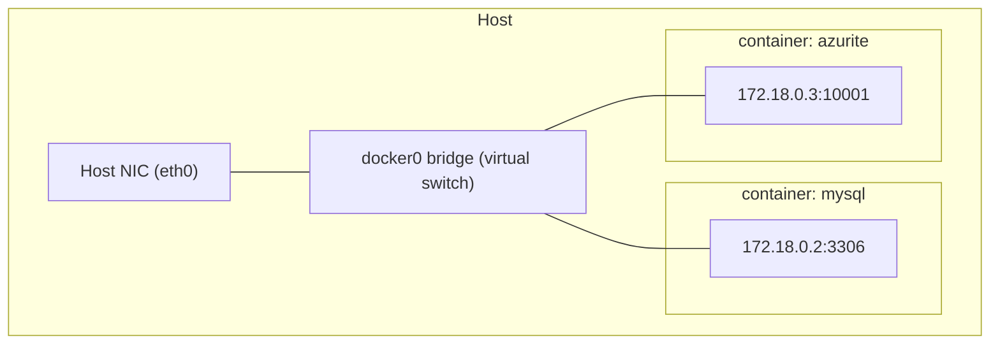

# Lesson 07: Networking & Volumes

> Containers are **isolated** by default — their own network stack, their own throwaway filesystem.
> To be useful they need to **talk** (networking) and **remember** (volumes). This lesson covers
> both, grounded in the MySQL + Azurite stack from Lesson 06.

---

# Part 1 — Networking

## The Default: Bridge Network

When Docker starts, it creates a virtual switch called `bridge` (`docker0`). Each container gets a
**veth pair** (a virtual cable) plugging it into that switch, and a private IP like `172.17.0.x`.



## Publishing Ports: `-p host:container`

A container port is **not** reachable from your machine until you **publish** it. That's what
`ports: "3306:3306"` in the compose file does.

```
-p 3306:3306
   └─┬─┘ └─┬─┘
   host  container
```

```bash
docker run -d -p 8080:8080 shipit:local   # host:8080 → container:8080
curl http://localhost:8080                  # now reachable from the host
```

| Form | Meaning |
|------|---------|
| `-p 8080:8080` | Host 8080 → container 8080 |
| `-p 127.0.0.1:8080:8080` | Only localhost can reach it (safer) |
| `-p 8080:80` | Host 8080 → container 80 (the diagram's `docker run -p 8080:80 nginx`) |
| `-P` | Publish all `EXPOSE`d ports on random host ports |

## User-Defined Networks & DNS

The default `bridge` has **no name-based DNS**. Compose (and `docker network create`) make a
**user-defined bridge**, which adds automatic DNS by **container/service name** — this is why
ShipIt can reach the database at `mysql:3306`.

```bash
docker network create shipit-net
docker run -d --name db --network shipit-net mysql:8.0
docker run --rm --network shipit-net alpine ping -c1 db   # resolves "db" by name ✅
```

| Network mode | Isolation | Use case |
|--------------|-----------|----------|
| `bridge` (default) | Isolated, NAT to host | Most apps |
| user-defined bridge | Isolated **+ DNS by name** | Multi-container apps (Compose) |
| `host` | **No** isolation — shares host network | Max perf, lose port mapping |
| `none` | No networking at all | Batch jobs, security |

## localhost Is a Trap

```
Inside a container, `localhost` = THE CONTAINER ITSELF, not the host, not other containers.
```

| From... | To reach MySQL, use... |
|---------|------------------------|
| Your host shell | `127.0.0.1:3306` (published port) |
| Another container (same Compose network) | `mysql:3306` (service name) |
| A container reaching a service on the **host** | `host.docker.internal` (Docker Desktop) |

> The #1 beginner bug: an app container using `localhost:3306` to find the DB container. It won't
> work — `localhost` is the app container itself. Use the **service name**.

---

# Part 2 — Volumes & Persistence

## The Problem: Containers Forget

A container's writable layer is **deleted when the container is removed** (Lesson 02). Run a MySQL
container, write data, `docker rm` it → **data gone**. Volumes fix this by storing data **outside**
the container's lifecycle.

## Three Ways to Persist

| Type | Syntax | Managed by | Best for |
|------|--------|-----------|----------|
| **Named volume** | `mysql_data:/var/lib/mysql` | Docker | Databases, app state |
| **Bind mount** | `./schema:/docker-entrypoint-initdb.d` | You (host path) | Source code, config files |
| **tmpfs** | `--tmpfs /tmp` | RAM only | Secrets, scratch data (never hits disk) |

Both first two appear in this repo's `docker-compose.yml`:

```yaml
volumes:
  - mysql_data:/var/lib/mysql                                # named volume — DB survives restarts
  - ./schema/deployments.sql:/docker-entrypoint-initdb.d/01-deployments.sql:ro  # bind mount — repo file in
```

### Named Volume vs Bind Mount

```
NAMED VOLUME                          BIND MOUNT
Docker-managed location               A path YOU choose on the host
(/var/lib/docker/volumes/...)         (./schema, C:\repo\schema)
Portable across machines              Tied to that host's filesystem
Great for: data you don't edit        Great for: code/config you DO edit
```

> **Rule of thumb:** app-generated data (databases) → **named volume**. Files you author and want
> the container to see live (source, config, SQL) → **bind mount**.

## Volume Lifecycle

```bash
docker volume ls                         # list volumes
docker volume inspect mysql_data         # where/how it's stored
docker compose down                      # removes containers, KEEPS named volumes
docker compose down -v                   # ALSO deletes named volumes (data wiped!)
docker volume prune                      # delete all unused volumes
```

**This is the key mental model:** the container is disposable; the **volume outlives it**. You can
`docker rm` and recreate the MySQL container all day — as long as `mysql_data` survives, so does
your data.

---

## Try It

```bash
# 1. Prove data persists across container recreation
docker compose up -d
docker compose exec mysql mysql -uroot -pdevpass shipit -e \
  "CREATE TABLE t(x INT); INSERT INTO t VALUES (42);"

docker compose rm -sf mysql          # destroy the MySQL CONTAINER
docker compose up -d mysql           # recreate it (same volume)
docker compose exec mysql mysql -uroot -pdevpass shipit -e "SELECT * FROM t;"
# → 42  (survived, because mysql_data volume persisted) ✅

# 2. Prove service-name networking works
docker compose exec azurite ping -c1 mysql    # resolves the DB by service name

# 3. Now actually wipe it
docker compose down -v               # deletes mysql_data — data is gone
```

---

## Key Takeaways

1. **Containers get a private network + IP** on a bridge; ports aren't reachable until **published** (`-p`).
2. **User-defined networks add DNS by name** — that's how `mysql:3306` works in Compose.
3. **`localhost` inside a container is the container itself** — use service names for other containers.
4. **The writable layer is ephemeral** — removing a container deletes its data.
5. **Named volumes persist app data**; **bind mounts map host files** (code/config) in.
6. **`down` keeps volumes, `down -v` deletes them** — treat containers as disposable, volumes as durable.

---

## Next: [Lesson 08 — Best Practices & Security](08-best-practices-and-security.md)
The final lesson: small images, non-root users, scanning, and signing — production hardening.
