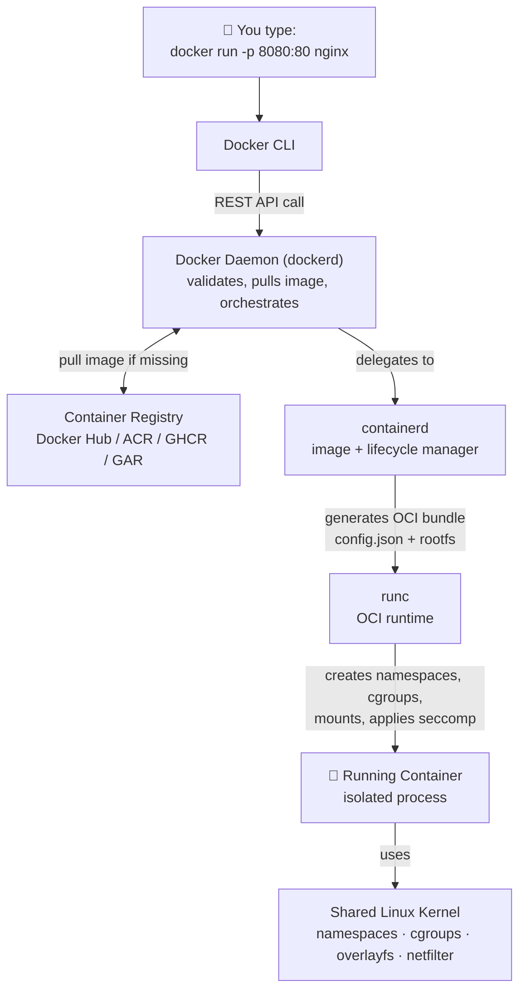

# Docker Learning Track

> **Learn how Docker *actually* works — then containerize the ShipIt orchestrator you built in the Go track.**

The [main Go track](../../README.md#learning-path-each-commit--one-lesson) teaches you to
build **ShipIt**, a real deployment orchestrator. This track teaches you the other half of
"production-grade": **how that binary gets packaged, shipped, and run as a container.**

Every lesson is grounded in this repo's *real* `Dockerfile` and `docker-compose.yml` — not toy
examples. And just like the Go lessons map concepts to C#/Java, each Docker lesson maps concepts
to **things you already know** (a class, an object, a `.zip`, a VM).

---

## Who Is This For?

Developers who can *use* `docker run` and `docker build` but have never looked **under the hood** —
what actually happens between typing a command and a process running in isolation. If you've ever
wondered "what's the difference between `dockerd`, `containerd`, and `runc`?" or "why is a Go image
10MB but a Java image 150MB?", start here.

---

## Learning Path

| # | Docker Concept | What You'll Understand | Doc |
|---|---------------|------------------------|-----|
| 01 | How Docker Works Under the Hood | CLI → `dockerd` → `containerd` → `runc` → kernel | [Lesson 01](01-how-docker-works.md) |
| 02 | Images & Layers | Union filesystem, read-only layers, copy-on-write | [Lesson 02](02-images-and-layers.md) |
| 03 | Dockerfile Deep Dive | Multi-stage builds, `FROM scratch`, layer caching | [Lesson 03](03-dockerfile-deep-dive.md) |
| 04 | Containers & Isolation | namespaces, cgroups, capabilities, seccomp | [Lesson 04](04-containers-and-isolation.md) |
| 05 | Registries | Docker Hub / ACR / GHCR / GAR, push, pull, digests | [Lesson 05](05-registries.md) |
| 06 | Docker Compose | Multi-container local dev (MySQL + Azurite) | [Lesson 06](06-docker-compose.md) |
| 07 | Networking & Volumes | Bridge networks, port publishing, persistence | [Lesson 07](07-networking-and-volumes.md) |
| 08 | Best Practices & Security | Small images, non-root, scanning, signing | [Lesson 08](08-best-practices-and-security.md) |

---

## The Big Picture

Docker is not one program. It's a **stack of components**, each with one job. This is the
single most important thing to understand — everything else falls into place once you see it:



**Key insight:** a container is **not a VM**. There is no guest OS. It's just a normal Linux
process that the kernel has been told to *isolate* using **namespaces** (what it can see) and
**cgroups** (what it can use). Docker's whole job is to set that up for you.

---

## Docker ↔ What You Already Know

| Docker concept | It's basically... | Analogy |
|----------------|-------------------|---------|
| **Image** | A read-only template | A **class** / a `.zip` of a filesystem |
| **Container** | A running instance of an image | An **object** (`new MyClass()`) |
| **Dockerfile** | Build recipe | A `Makefile` / `.csproj` build steps |
| **Registry** | Where images are stored & shared | **NuGet / Maven Central / npm**, but for images |
| **Layer** | One immutable filesystem diff | A **git commit** on top of the previous |
| **Volume** | Persistent storage outside the container | A **mounted network drive** |
| **`docker compose`** | Multi-container app definition | Your `docker run` flags, **as code** |

---

## Prerequisites

```bash
# Install Docker Desktop (Windows/macOS) or Docker Engine (Linux)
docker --version          # Docker version 24+
docker compose version    # Docker Compose version v2+

# Verify it works
docker run hello-world
```

---

## Next: [Lesson 01 — How Docker Works Under the Hood](01-how-docker-works.md)
